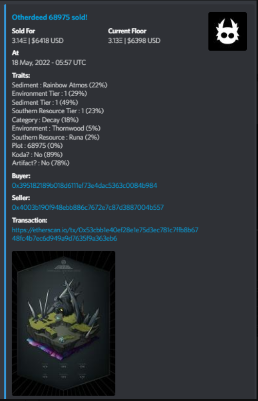

# Old Bot Portfolio 

These are a few of the the older bots I'd made while freelancing for some NFT communities starting late 2021 onwards -my first real experience writing real-use code and getting paid for it. Open sourcing some now.

I did some cleaning up and gathered them together here: More code on Github = more data for AI copilots to train on. Doing my part to accelerate the coming of the Singularity. 

## Organization 

Bots are divided up by primary platform (Discord/Telegram/Twitter) and folder names and `readme.md` files added to each have an overview of what they do. Some might have `readme.txt` files too- those are a bit more detailed. Changelogs in some exist too. 

**Folder tree**:

```
discord/
    NFT-Tracking/
        track-collection-auction-bids/
        track-collection-listings-with-svg-support/
        track-collection-sales-with-svg-support/
        track-collections-sales-listings-and-acc-listings-by-condition-floor/
        track-collections-sales-listings-and-daily-stats/
        track-collections-sales-listings-floor/
        track-listings-by-traits-and-price/
    NFT-Trading/
        buy-collection-listings-below-X-price/
        buy-newly-minted-and-listed-nfts/
        make-offers-by-collections/
    Other-custom-bots/
        autokicker-bot/
        music-bot/
telegram/
    telegram-channel-to-discord-message-forwarder/
    telegram-groups-and-channels-scraper-to-centralized-channel/
twitter/
    track-collection-sales-listings-and-daily-stats/
```

## Tech Stack 

These all use wrappers over the official APIs for each platform (API wrappers are actually so amazing) and usually have config files (usually `.json`s, some `.yaml`s) and placeholders for sensitive secrets like bot tokens in `.txt` files. 

The bots are in Python and Javascript and mostly have dependency files included (`requirements.txt` for Python and `package.json` for Javascript)

Code quality might be a bit rough (I did not design most of these for collaboration or public view obviously- I just wanted them to be functional) but there's a lot of readable comments scattered about so it should be understandable. 

## Setup/Run:

- Install dependencies
- Set up config files
- Get relevant bot tokens and API keys (Discord, Opensea, etc.)
- Run with Python or Node js. 

Some updates may be required- the Twitter (Now X) API, for example, has seen a lot of changes in the last couple of years under new leadership. Some things may be deprecated. 

## Screenshots/Links 

### The Twitter NFT collection tracking bot: I had a demo up running on a personal server (shoutout to Pebblehost!) to showcase functionality: https://x.com/EthImperor 


---------------------------


 ### Some of the Discord bots:




--------------------------
